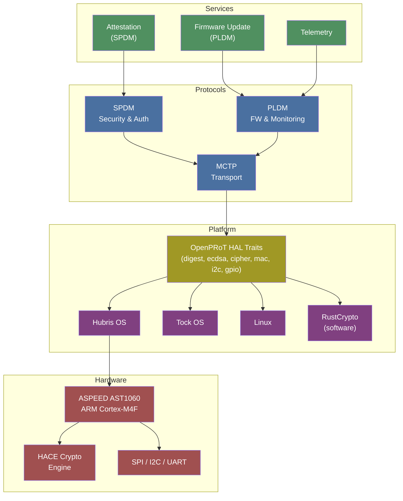

# OpenPRoT: The Complete Guide

**Open Platform Root of Trust — An open-source firmware stack for Platform Root of Trust devices**

[](https://www.chipsalliance.org/)
[](https://github.com/OpenPRoT/openprot/blob/main/LICENSE)
[](https://www.rust-lang.org/)

---

OpenPRoT is a vendor-neutral, open-source firmware stack for Platform Root of Trust devices, built in Rust under the CHIPS Alliance. It implements MCTP, SPDM, and PLDM protocols for secure platform management.

## Architecture Overview



## Documentation

The full guide is organized into topic-based pages under [`docs/`](docs/README.md):

| Topic | Description |
|-------|-------------|
| [Introduction](docs/01-introduction.md) | What is OpenPRoT and why it exists |
| [Architecture](docs/02-architecture.md) | Layered architecture overview |
| [Protocols](docs/03-protocols/README.md) | MCTP, SPDM, and PLDM deep dives |
| [Repository Map](docs/04-repository-map.md) | All repos and how they relate |
| [Hardware Targets](docs/05-hardware-targets.md) | ASPEED chips and peripherals |
| [Getting Started](docs/06-getting-started.md) | Prerequisites and setup |
| [Building & Running](docs/07-building-and-running.md) | Build, QEMU, debug |
| [Tutorial: Secure Firmware Update](docs/08-tutorial-secure-firmware-update.md) | Step-by-step protocol walkthrough |
| [Services Deep Dive](docs/09-services-deep-dive.md) | Attestation, FW update, telemetry |
| [Standards & Compliance](docs/10-standards-and-compliance.md) | DMTF, TCG, NIST, OCP |
| [Use Cases](docs/11-use-cases.md) | Real-world scenarios |
| [Resources](docs/12-resources.md) | Links, references, license |

## Quick Start

```bash
# Install Rust and embedded target
curl --proto '=https' --tlsv1.2 -sSf https://sh.rustup.rs | sh
rustup target add thumbv7em-none-eabihf

# Clone and build
git clone https://github.com/OpenPRoT/openprot.git
cd openprot && cargo xtask build
```

See the [full getting started guide](docs/06-getting-started.md) for details.

---

*This guide was compiled from the [OpenPRoT GitHub organization](https://github.com/orgs/OpenPRoT/repositories) and related public sources.*
