# OpenPRoT: The Complete Guide

**Open Platform Root of Trust — An open-source firmware stack for Platform Root of Trust devices**

[](https://www.chipsalliance.org/)
[](https://github.com/OpenPRoT/openprot/blob/main/LICENSE)
[](https://www.rust-lang.org/)

---

## Table of Contents

1. [What is OpenPRoT?](#what-is-openprot)
2. [Why OpenPRoT Exists](#why-openprot-exists)
3. [Architecture Overview](#architecture-overview)
4. [Core Protocols](#core-protocols)
   - [MCTP — Transport Layer](#mctp--transport-layer)
   - [SPDM — Security & Attestation](#spdm--security--attestation)
   - [PLDM — Firmware & Monitoring](#pldm--firmware--monitoring)
5. [Repository Map](#repository-map)
6. [Hardware Targets](#hardware-targets)
7. [Getting Started](#getting-started)
8. [Tutorial: Building & Running](#tutorial-building--running)
9. [Tutorial: Understanding the Protocol Stack](#tutorial-understanding-the-protocol-stack)
10. [Services Layer Deep Dive](#services-layer-deep-dive)
11. [Industry Standards & Compliance](#industry-standards--compliance)
12. [Use Cases](#use-cases)
13. [Resources & Community](#resources--community)

---

## What is OpenPRoT?

**OpenPRoT** (Open Platform Root of Trust) is an open-source, standards-based firmware stack for **Platform Root of Trust (PRoT)** devices. It is a collaborative project under the **CHIPS Alliance** (part of the Linux Foundation), announced at the OCP Global Summit in October 2025.

A Platform Root of Trust is a dedicated security chip on a server motherboard that:

- Verifies firmware integrity before the system boots
- Provides cryptographic identity and attestation
- Manages secure firmware updates
- Monitors platform health and security policies

Think of it as the **security foundation** that everything else on the platform trusts.

### Project Goals

| Goal | Description |
|------|-------------|
| **Open Standard** | Create an OCP specification for PRoT firmware |
| **Open Source** | Provide a reference implementation anyone can use |
| **Interoperability** | Enable different vendors' hardware to work together |
| **Security** | Memory-safe Rust implementation eliminates vulnerability classes |
| **Modularity** | Clean separation of concerns for portability and reuse |

---

## Why OpenPRoT Exists

### The Problem

Today's PRoT solutions are overwhelmingly **proprietary**:

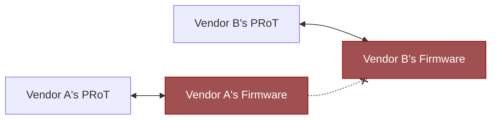
> No interoperability — each vendor is locked in

This leads to:
- **Slow time-to-market** — each vendor builds from scratch
- **Vendor lock-in** — switching silicon vendors means rewriting firmware
- **Opaque security** — proprietary code can't be audited by customers
- **Supply chain risk** — single-vendor dependency

### The Solution

OpenPRoT provides a **vendor-neutral, open firmware stack**:

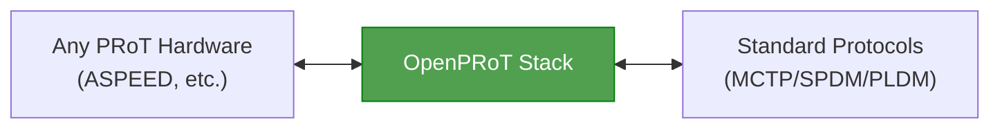

---

## Architecture Overview

OpenPRoT uses a **layered architecture** with clear separation of concerns:

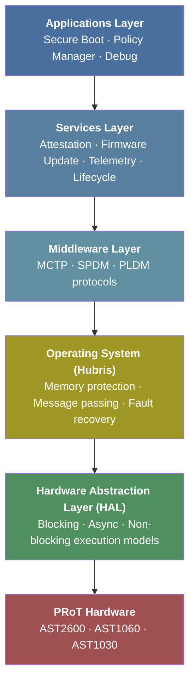

### Layer Responsibilities

**HAL (Hardware Abstraction Layer)** — Located in `/hal/`
- Rust traits for I/O peripherals (I2C, SPI) and crypto accelerators
- Three execution models: `blocking`, `async`, and `nb` (non-blocking)
- Leverages `embedded-hal` and `RustCrypto` ecosystems

**Operating System (Hubris)** — Fork of Oxide Computer's Hubris
- Microkernel with MPU-enforced memory isolation
- Static task allocation (no dynamic memory)
- In-place task restart for fault recovery
- Chosen for deterministic, security-critical behavior

**Middleware** — Protocol implementations
- MCTP for transport, SPDM for security, PLDM for management
- Each implemented as a standalone `no_std` Rust library

**Services** — Business logic
- Attestation, firmware update, telemetry, lifecycle management

**Applications** — Top-level orchestration
- Secure boot flow, policy enforcement, debug access control

---

## Core Protocols

The three protocols form a stack where **MCTP** is the foundation:

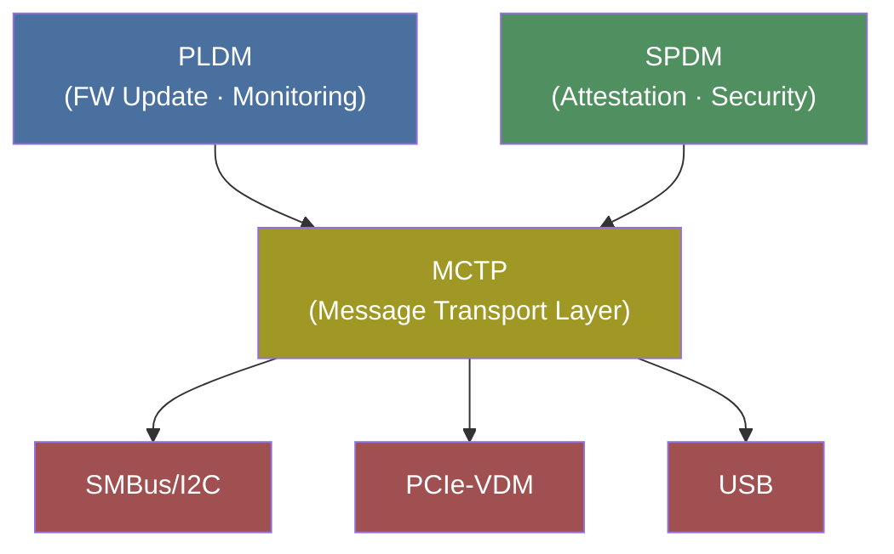

### MCTP — Transport Layer

**Management Component Transport Protocol** (DMTF DSP0236)

MCTP is the "postal service" for platform management — it delivers messages between components regardless of the physical connection.

**Key concepts:**
- **EID (Endpoint ID)** — Address for each component on the MCTP network
- **Bindings** — Physical transport adapters (SMBus, PCIe, USB, serial)
- **Message Types** — Identifies which protocol a message belongs to (SPDM, PLDM, etc.)

**Repositories:**
- [`mctp-lib`](https://github.com/OpenPRoT/mctp-lib) — Standalone embedded library
- [`mctp-rs`](https://github.com/OpenPRoT/mctp-rs) — Comprehensive workspace with Linux support

**Example: Sending an MCTP message (Linux)**
```rust
use mctp_linux::MctpLinuxReq;

// Connect to endpoint with EID 8
let mut ep = MctpLinuxReq::new(8, None)?;

// Send a control message (Get Endpoint ID = command 0x02)
let tx_buf = vec![0x02u8];
ep.send(MCTP_TYPE_CONTROL, &tx_buf)?;

// Receive response
let mut rx_buf = vec![0u8; 16];
let (msg_type, integrity_check, data) = ep.recv(&mut rx_buf)?;
println!("Response: {:?}", data);
```

### SPDM — Security & Attestation

**Security Protocol and Data Model** (DMTF DSP0274)

SPDM establishes trust between platform components. It answers: *"Are you who you claim to be, and is your firmware intact?"*

**Key capabilities:**
| Capability | Purpose |
|-----------|---------|
| **Authentication** | Verify device identity via certificate chains |
| **Attestation** | Report firmware measurements (integrity proof) |
| **Secure Sessions** | Encrypted communication channels |
| **CSR Generation** | Request new certificates |

**Dual roles in OpenPRoT:**
- **Responder** — Proves its identity to external verifiers
- **Requester** — Verifies downstream devices

**Required algorithms:**
- Signing: `ECDSA_ECC_NIST_P384`
- Hashing: `SHA3_384`

**Attestation flow:**
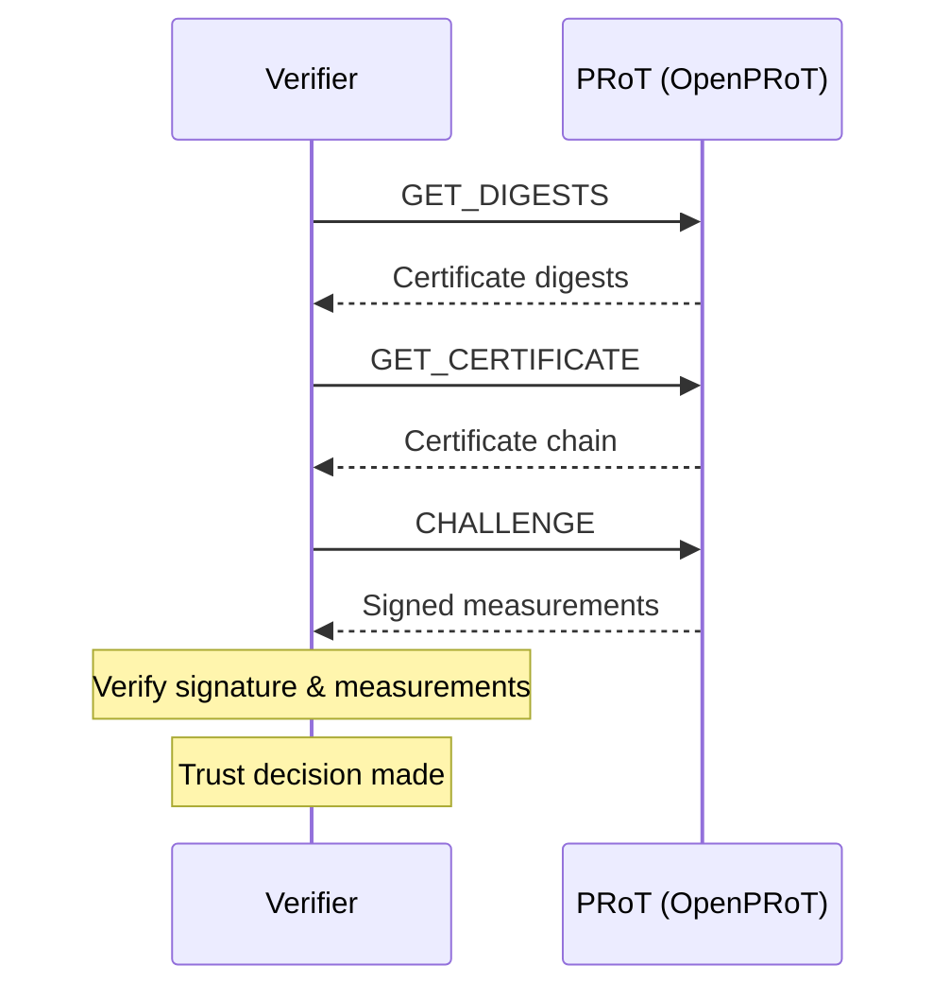

### PLDM — Firmware & Monitoring

**Platform Level Data Model** (DMTF DSP0240/DSP0248/DSP0267)

PLDM handles the practical management tasks: updating firmware, reading sensors, and monitoring health.

**Three PLDM types used in OpenPRoT:**

| Type | Name | Purpose |
|------|------|---------|
| Type 0 | Base | Discovery and version negotiation |
| Type 2 | Platform Monitoring | Sensor data, PDR repository |
| Type 5 | Firmware Update | Secure firmware transfer and activation |

**Firmware update workflow:**
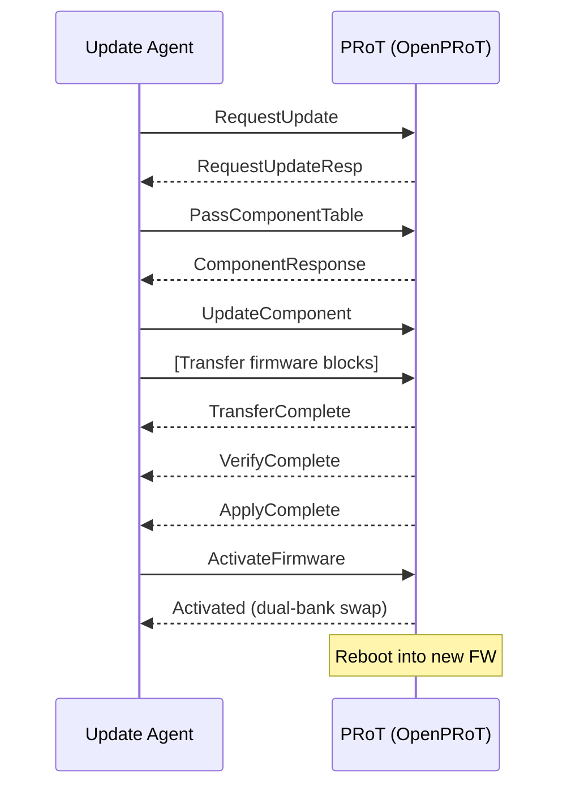

**Component types:**
- `0x0` — OpenPRoT runtime image
- `0x1` — Downstream SoC manifest
- `0x2` — Downstream SoC firmware
- `0x3` — Downstream EEPROM
- `≥0x1000` — Vendor-defined

---

## Repository Map

| Repository | Description | Language |
|-----------|-------------|----------|
| [`openprot`](https://github.com/OpenPRoT/openprot) | **Main repo** — firmware stack, HAL, services, docs | Rust |
| [`mctp-lib`](https://github.com/OpenPRoT/mctp-lib) | Standalone MCTP library (embedded, `no_std`) | Rust |
| [`mctp-rs`](https://github.com/OpenPRoT/mctp-rs) | MCTP workspace (Linux + embedded + PLDM) | Rust |
| [`spdm-lib`](https://github.com/OpenPRoT/spdm-lib) | Standalone SPDM library | Rust |
| [`pldm-lib`](https://github.com/OpenPRoT/pldm-lib) | Standalone PLDM library | Rust |
| [`aspeed-rust`](https://github.com/OpenPRoT/aspeed-rust) | ASPEED MCU support (AST1060/AST1030) | Rust |
| [`hubris`](https://github.com/OpenPRoT/hubris) | Fork of Oxide's Hubris microkernel | Rust |
| [`pigweed`](https://github.com/OpenPRoT/pigweed) | Fork of Google's Pigweed embedded framework | — |
| [`.github`](https://github.com/OpenPRoT/.github) | Org profile and governance docs | — |

### How repositories relate

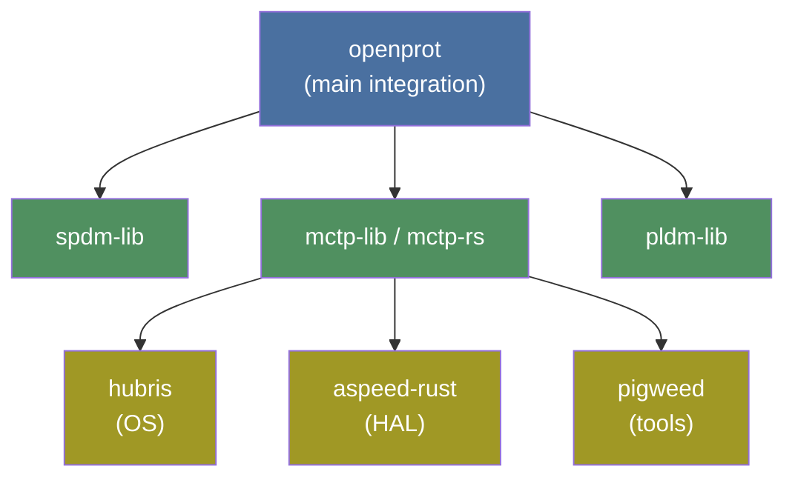

---

## Hardware Targets

### ASPEED BMC Chips

OpenPRoT primarily targets **ASPEED** microcontrollers commonly found in server BMCs:

| Chip | Type | Core | Use Case |
|------|------|------|----------|
| **AST1060** | PRoT SoC | ARM Cortex-M4 | Primary PRoT target |
| **AST1030** | PRoT SoC | ARM Cortex-M4 | Alternative PRoT |
| **AST2600** | BMC SoC | ARM Cortex-A7 | Server management |

**Target triple:** `thumbv7em-none-eabihf` (ARM Cortex-M4 with hardware float)

### Peripheral support

- **I2C** — Target mode for MCTP-over-SMBus
- **SPI** — With DMA and monitoring capabilities
- **Crypto accelerators** — RSA, ECDSA, HMAC, SHA (hardware-accelerated)

---

## Getting Started

### Prerequisites

```bash
# 1. Install Rust (1.70+ required)
curl --proto '=https' --tlsv1.2 -sSf https://sh.rustup.rs | sh

# 2. Add the embedded ARM target
rustup target add thumbv7em-none-eabihf

# 3. Install cargo-binutils (for objcopy, etc.)
cargo install cargo-binutils
rustup component add llvm-tools-preview

# 4. (Optional) Install QEMU for emulation
sudo apt install qemu-system-arm    # Debian/Ubuntu
brew install qemu                    # macOS
```

### Clone the repositories

```bash
# Main firmware stack
git clone https://github.com/OpenPRoT/openprot.git

# Individual protocol libraries (if working on them separately)
git clone https://github.com/OpenPRoT/mctp-rs.git
git clone https://github.com/OpenPRoT/spdm-lib.git
git clone https://github.com/OpenPRoT/pldm-lib.git

# Hardware support
git clone https://github.com/OpenPRoT/aspeed-rust.git
```

---

## Tutorial: Building & Running

### 1. Building the main project

```bash
cd openprot

# Build everything
cargo xtask build

# Run tests
cargo xtask test

# Run all pre-checkin validation (build + test + clippy + fmt)
cargo xtask precheckin
```

### Available xtask commands

```bash
cargo xtask build         # Build the project
cargo xtask test          # Run all tests
cargo xtask check         # Run cargo check
cargo xtask clippy        # Run clippy lints
cargo xtask fmt           # Format code
cargo xtask clean         # Clean artifacts
cargo xtask dist          # Build release distribution
cargo xtask docs          # Build mdbook documentation
cargo xtask header-check  # Check license headers
cargo xtask header-fix    # Fix missing license headers
cargo xtask precheckin    # Run all checks (CI equivalent)
```

### 2. Building the ASPEED target

```bash
cd aspeed-rust

# Build for AST1060
cargo build --target thumbv7em-none-eabihf

# Generate a raw binary for flashing
cargo objcopy --target thumbv7em-none-eabihf -- -O binary firmware.bin
```

### 3. Running in QEMU (emulation)

```bash
# Run the AST1030 EVB emulation
qemu-system-arm \
  -M ast1030-evb \
  -nographic \
  -kernel target/thumbv7em-none-eabihf/debug/aspeed-ddk
```

### 4. Debugging on real hardware

```bash
# Terminal 1: Start JLink GDB server
JLinkGDBServer -device cortex-m4 -if swd

# Terminal 2: Connect with GDB
gdb-multiarch target/thumbv7em-none-eabihf/release/aspeed-ddk
# In GDB:
#   target remote :2331
#   monitor semihosting IOClient 2
#   load
#   continue
```

### 5. Building documentation

```bash
cd openprot
cargo xtask docs
# Opens in browser, or find HTML in docs/book/
```

Online docs are also available at: https://openprot.github.io/openprot/

### 6. Working with MCTP on Linux

```bash
cd mctp-rs

# Build all crates in the workspace
cargo build

# Run the PLDM firmware update CLI tool
cargo run -p pldm-fw-cli -- --help

# Run MCTP examples
cargo run -p mctp-linux --example <example_name>
```

---

## Tutorial: Understanding the Protocol Stack

This section walks through how the three protocols work together in a real scenario.

### Scenario: Secure Firmware Update

When a server admin pushes a firmware update to a PRoT running OpenPRoT, here's what happens:

#### Step 1: Transport Setup (MCTP)

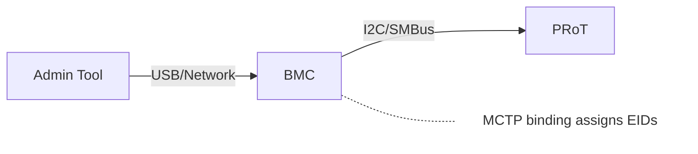

The MCTP layer establishes communication. Each component gets an Endpoint ID (EID), and messages are routed over the physical transport (I2C, USB, etc.).

#### Step 2: Authentication (SPDM)

Before accepting any firmware, the PRoT and update agent authenticate each other:

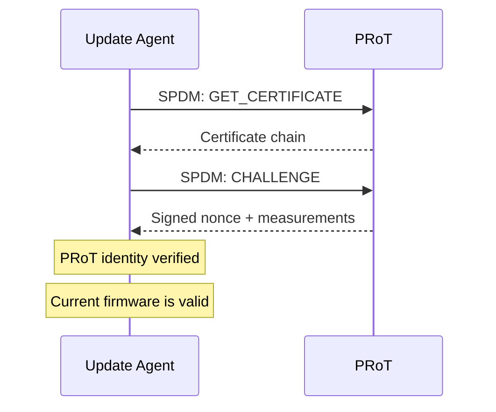

#### Step 3: Firmware Transfer (PLDM)

With trust established, the actual update proceeds:

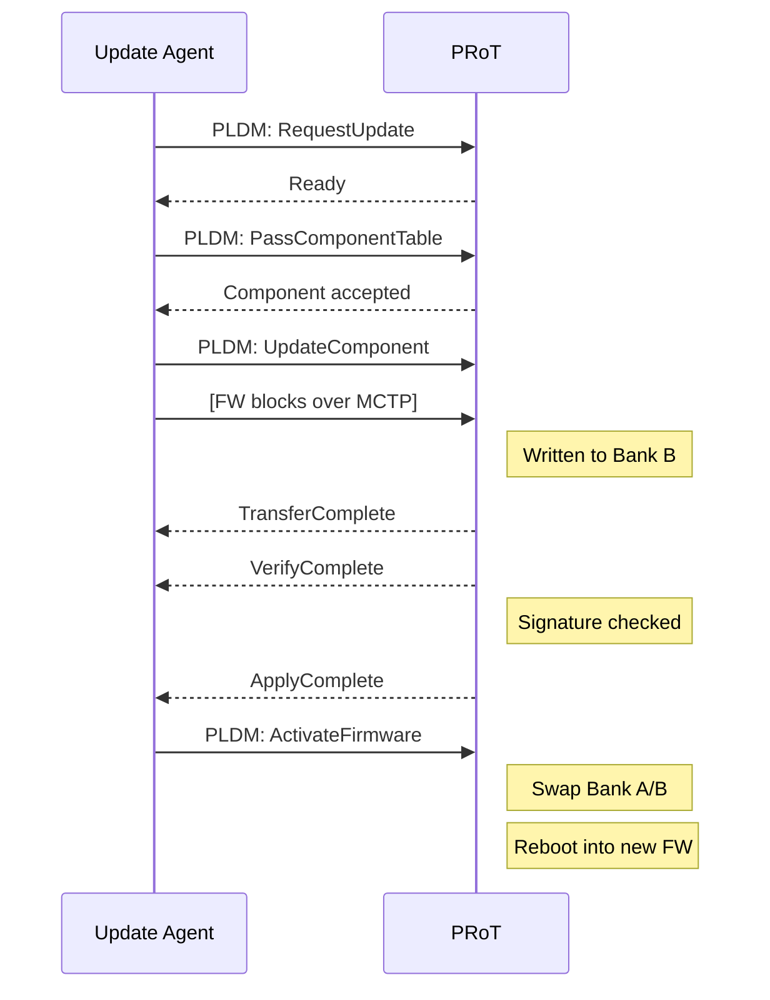

#### Step 4: Post-Update Attestation (SPDM)

After reboot, the verifier confirms the new firmware:

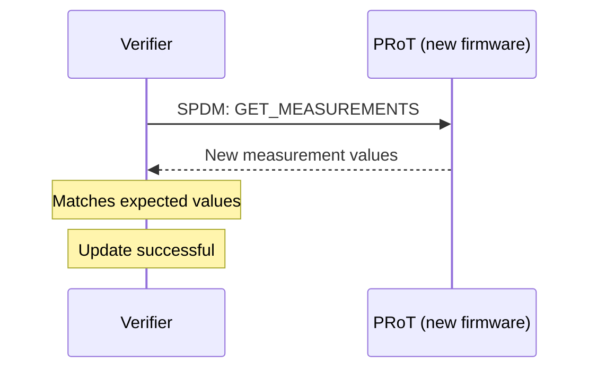

### Key Takeaway

The three protocols have distinct, complementary roles:
- **MCTP** = How messages travel (transport)
- **SPDM** = Who you're talking to and can you trust them (security)
- **PLDM** = What you're actually doing (management operations)

---

## Services Layer Deep Dive

### Attestation Service

Provides cryptographic proof of platform identity and firmware integrity.

**Capabilities:**
- SPDM Responder — proves identity to external verifiers
- SPDM Requester — verifies downstream devices
- Local Verifier — on-platform trust decisions (for air-gapped environments)
- Evidence format: RATS EAT (Entity Attestation Token) with OCP profile

**DICE integration:**
The PRoT uses a DICE (Device Identifier Composition Engine) chain to build layered measurements from hardware through each firmware stage:


Each stage measures the next and derives a new Compound Device Identifier (CDI), creating an unforgeable chain of trust.

### Firmware Update & Recovery

Follows NIST SP 800-193 (Platform Firmware Resiliency):

- **Dual-bank storage** — Active bank + recovery bank
- **Authenticated packages** — Cryptographic signature verification
- **Rollback protection** — Anti-rollback counters prevent downgrade attacks
- **Automatic recovery** — Falls back to known-good bank on boot failure

### Telemetry Service

Platform monitoring via PLDM Type 2:
- Temperature, voltage, and power sensors
- Platform Data Records (PDR) repository
- Standardized sensor descriptions for management tools

---

## Industry Standards & Compliance

OpenPRoT aligns with specifications from multiple standards bodies:

### DMTF (Distributed Management Task Force)
| Spec | Version | Protocol |
|------|---------|----------|
| DSP0236 | v1.3.1+ | MCTP Base |
| DSP0237 | — | MCTP over SMBus |
| DSP0274 | v1.2+ | SPDM |
| DSP0277 | — | Secured Messages over MCTP |
| DSP0240 | — | PLDM Base |
| DSP0248 | — | PLDM Platform Monitoring |
| DSP0267 | — | PLDM Firmware Update |

### TCG (Trusted Computing Group)
- DICE Layering Architecture
- DICE Attestation Architecture
- DICE Protection Environment (DPE)

### NIST
- SP 800-193 — Platform Firmware Resiliency
- FIPS 186-5 — Digital Signature Standard

### OCP (Open Compute Project)
- OCP Attestation Spec 1.1
- OCP RATS EAT Profile

---

## Use Cases

### 1. Data Center Server Security
Secure boot verification and continuous attestation for every server in the fleet.

### 2. Supply Chain Verification
Prove hardware authenticity from manufacturing through deployment — detect tampered components before they enter production.

### 3. Secure Firmware Updates
Authenticated, dual-bank firmware updates with automatic rollback on failure. No bricked devices.

### 4. Platform Composition Attestation
Verify the entire stack — from PRoT hardware through BMC firmware to host OS — as a single trust chain.

### 5. Air-Gapped Environments
The local verifier enables trust decisions without external network access, critical for classified or isolated deployments.

### 6. Multi-Vendor Platforms
Mix and match PRoT hardware from different vendors while maintaining a single, standard firmware stack.

---

## Resources & Community

### Links

| Resource | URL |
|----------|-----|
| **GitHub Organization** | https://github.com/OpenPRoT |
| **Online Documentation** | https://openprot.github.io/openprot/ |
| **CHIPS Alliance** | https://www.chipsalliance.org/ |
| **Mailing List** | https://lists.chipsalliance.org/g/openprot-wg |
| **Email** | openprot-wg@lists.chipsalliance.org |

### Key References

- [AMD Blog: OpenPRoT — Building a Secure Foundation](https://www.amd.com/en/blogs/2025/openprot--building-a-secure-and-transparent-foundation-for-platf.html)
- [CHIPS Alliance OCP 2025 Recap](https://www.chipsalliance.org/news/ocp-2025-recap/)
- [DMTF SPDM Standards](https://www.dmtf.org/standards/spdm)
- [DMTF MCTP Overview](https://www.dmtf.org/sites/default/files/standards/documents/DSP2016.pdf)
- [NIST SP 800-193: Platform Firmware Resiliency](https://csrc.nist.gov/publications/detail/sp/800-193/final)

### License

OpenPRoT main repositories use **Apache License 2.0**. The Hubris fork uses **Mozilla Public License 2.0** (MPL-2.0).

---

*This guide was compiled from the [OpenPRoT GitHub organization](https://github.com/orgs/OpenPRoT/repositories) and related public sources.*
