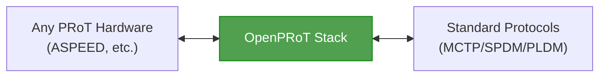

# Introduction

## What is OpenPRoT?

**OpenPRoT** (Open Platform Root of Trust) is an open-source, standards-based firmware stack for **Platform Root of Trust (PRoT)** devices. It is a collaborative project under the **CHIPS Alliance** (part of the Linux Foundation), announced at the OCP Global Summit in October 2025.

A Platform Root of Trust is a dedicated security chip on a server motherboard that:

- Verifies firmware integrity before the system boots
- Provides cryptographic identity and attestation
- Manages secure firmware updates
- Monitors platform health and security policies

Think of it as the **security foundation** that everything else on the platform trusts.

### Project Goals

| Goal | Description |
|------|-------------|
| **Open Standard** | Create an OCP specification for PRoT firmware |
| **Open Source** | Provide a reference implementation anyone can use |
| **Interoperability** | Enable different vendors' hardware to work together |
| **Security** | Memory-safe Rust implementation eliminates vulnerability classes |
| **Modularity** | Clean separation of concerns for portability and reuse |

---

## Why OpenPRoT Exists

### The Problem

Today's PRoT solutions are overwhelmingly **proprietary**:

> No interoperability — each vendor is locked in

This leads to:
- **Slow time-to-market** — each vendor builds from scratch
- **Vendor lock-in** — switching silicon vendors means rewriting firmware
- **Opaque security** — proprietary code can't be audited by customers
- **Supply chain risk** — single-vendor dependency

### The Solution

OpenPRoT provides a **vendor-neutral, open firmware stack**:

---

[Next: Architecture](02-architecture.md)
