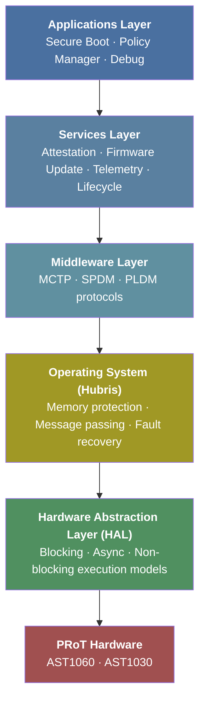

# Architecture Overview

OpenPRoT uses a **layered architecture** with clear separation of concerns:



## Layer Responsibilities

**HAL (Hardware Abstraction Layer)** — Located in `openprot/hal/`
- Rust traits for I/O peripherals (I2C, SPI, GPIO) and crypto accelerators (digest, ECDSA, cipher, MAC, key vault)
- Three execution models: `blocking`, `async`, and `nb` (non-blocking), each as a separate crate
- `#![no_std]` and `#![forbid(unsafe_code)]` throughout
- Uses `zerocopy` for zero-copy serialization and `zeroize` for secure key cleanup
- Dual API pattern: *scoped* (borrowed contexts for one-shot operations) and *owned* (move-based for session persistence across IPC)

**Platform Implementations** — Located in `openprot/platform/impls/`
- **Hubris** — Hubris OS integration with `CryptoSession<Context, Device>` RAII pattern
- **Linux** — Linux platform support
- **Tock** — Tock OS platform support
- **RustCrypto** — Software crypto backend using the RustCrypto ecosystem (p256/p384, sha2/sha3, aes-gcm)
- **Mock** — Stub implementations for testing without hardware

**Operating System (Hubris)** — Fork of Oxide Computer's Hubris
- Microkernel with MPU-enforced memory isolation
- Static task allocation (no dynamic memory)
- In-place task restart for fault recovery — a crash in one task (e.g., MCTP parser) cannot compromise crypto keys held by another
- Idol IDL for type-safe IPC between isolated tasks
- OpenPRoT adds AST1060 chip/board definitions, UART/I2C drivers, crypto servers (digest, ECDSA), and an MCTP server

**Middleware** — Protocol implementations
- MCTP for transport, SPDM for security, PLDM for management
- Each implemented as a standalone `no_std` Rust library
- See [Protocols](03-protocols/index.md) for implementation details

**Services** — Business logic (early stage)
- `services/telemetry` and `services/storage` crates exist as stubs
- Attestation, firmware update, and lifecycle management are planned

**Applications** — Top-level orchestration
- Secure boot flow, policy enforcement, debug access control
- The `openprot/openprot/` main crate is minimal, indicating the HAL trait definitions are the primary deliverable at this stage

## Workspace Structure

The main `openprot` repository is a 12-crate Cargo workspace:

```
openprot/
├── openprot/              # Main application crate
├── hal/
│   ├── blocking/          # Core HAL traits (digest, ECDSA, cipher, MAC, key vault, I2C, GPIO, system control)
│   ├── async/             # Re-exports embedded-hal-async 1.0
│   └── nb/                # Re-exports embedded-hal-nb 1.0
├── platform/
│   ├── traits/hubris/     # Hubris-specific integration traits
│   └── impls/
│       ├── hubris/        # Hubris OS implementation
│       ├── linux/         # Linux implementation
│       ├── tock/          # Tock OS implementation
│       ├── rustcrypto/    # Software crypto (RustCrypto)
│       └── baremetal/mock/# Mock/stub for testing
├── services/
│   ├── telemetry/         # Monitoring service (stub)
│   └── storage/           # Persistent storage (stub)
└── xtask/                 # Build automation
```

## Build Systems

- **Cargo** — Primary build system with `cargo xtask` automation
- **Bazel** — Being introduced alongside Pigweed integration (`BUILD.bazel`, `MODULE.bazel` present)
- **Nightly Rust toolchain** required

---

[Prev: Introduction](01-introduction.md) | [Next: Protocols](03-protocols/index.md)
