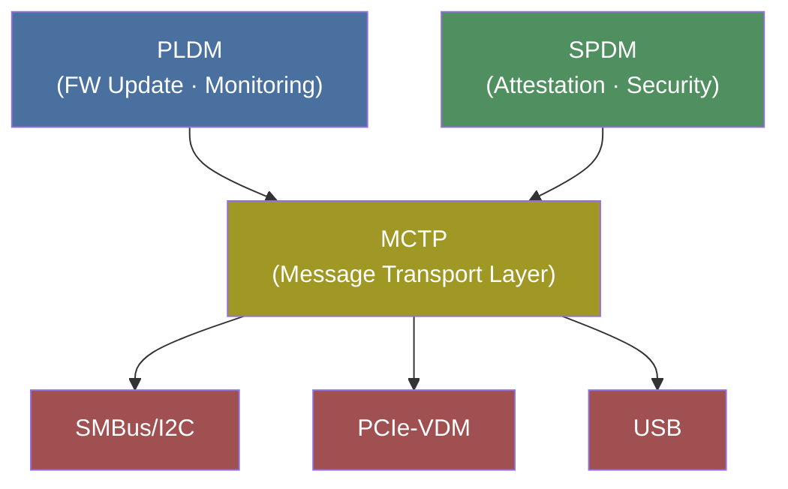

# Core Protocols

The three protocols form a stack where **MCTP** is the foundation:

## Protocol Deep Dives

| Protocol | Role | Details |
|----------|------|---------|
| [MCTP](mctp.md) | Transport Layer | Message delivery between components |
| [SPDM](spdm.md) | Security & Attestation | Identity verification and trust |
| [PLDM](pldm.md) | Firmware & Monitoring | Management operations |

## Key Takeaway

- **MCTP** = How messages travel (transport)
- **SPDM** = Who you're talking to and can you trust them (security)
- **PLDM** = What you're actually doing (management operations)

---

[Prev: Architecture](../02-architecture.md) | [Next: MCTP](mctp.md)
