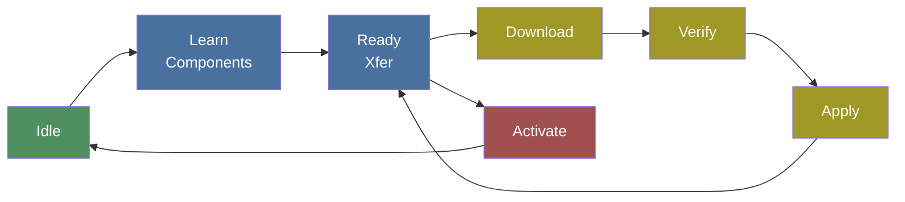

# PLDM — Firmware & Monitoring

**Platform Level Data Model** (DMTF DSP0240/DSP0248/DSP0267)

PLDM handles the practical management tasks: updating firmware, reading sensors, and monitoring health.

## PLDM Types

OpenPRoT has **two separate PLDM implementations** across its repositories:

### `pldm-lib` — Standalone Library (OpenPRoT-native)

A 3-crate `no_std` workspace (`pldm-lib` / `pldm-common` / `pldm-interface`):

| Type | Name | Status |
|------|------|--------|
| Type 0 | Base | **Implemented** — SetTid, GetTid, GetPldmVersion, GetPldmTypes, GetPldmCommands |
| Type 2 | Platform Monitoring | Defined in enum only — **not implemented** |
| Type 5 | Firmware Update | **Implemented** — Full state machine (v1.3.0, DSP0267) |

### `mctp-rs/pldm-fw` — Code Construct Implementation

Part of the `mctp-rs` workspace, provides both sides of the firmware update:

| Module | Target | Role |
|--------|--------|------|
| `fd` (Firmware Device) | `no_std` | Responder state machine for embedded targets |
| `ua` (Update Agent) | `std` | Requester for Linux-based update tools |
| `pkg` | `alloc` | PLDM firmware package parser |

## Firmware Update State Machine

Both implementations follow the same PLDM FW Update specification state machine:



**State transitions are enforced** — each command handler validates the current state and returns appropriate completion codes (`InvalidStateForCommand`, `AlreadyInUpdateMode`, `NotInUpdateMode`).

## Firmware Update Commands

| Command | Code | Direction | Purpose |
|---------|------|-----------|---------|
| QueryDeviceIdentifiers | 0x01 | UA→FD | Discover device identity |
| GetFirmwareParameters | 0x02 | UA→FD | Query firmware capabilities |
| RequestUpdate | 0x10 | UA→FD | Initiate update session |
| PassComponentTable | 0x13 | UA→FD | Describe available components |
| UpdateComponent | 0x14 | UA→FD | Start component transfer |
| RequestFirmwareData | 0x15 | FD→UA | FD requests data chunks |
| TransferComplete | 0x16 | FD→UA | Transfer finished |
| VerifyComplete | 0x17 | FD→UA | Verification result |
| ApplyComplete | 0x18 | FD→UA | Apply result |
| ActivateFirmware | 0x1A | UA→FD | Activate new firmware |
| GetStatus | 0x1B | UA→FD | Query update status |
| CancelUpdate | 0x1D | UA→FD | Abort update |

## CLI Tool

The `pldm-fw-cli` tool (from `mctp-rs`) provides a command-line interface for firmware management over Linux MCTP sockets:

```bash
# Query device firmware inventory
pldm-fw inventory <net>,<eid>

# Update firmware from a package file
pldm-fw update <net>,<eid> firmware-package.bin

# Inspect package contents
pldm-fw pkg-info firmware-package.bin

# Extract component images
pldm-fw extract firmware-package.bin 0 1
```

## Code Patterns

- **Zero-copy serialization** — `#[repr(C, packed)]` structs with `zerocopy` derives get automatic codec implementation
- **In-place message processing** — Responses encoded into the same buffer as the decoded request
- **Pluggable device operations** — `FdOps` struct provides hardware callbacks (verify, apply, activate)
- **No heap allocation** — All data structures use fixed-size arrays with compile-time constants

---

[Prev: SPDM](spdm.md) | [Next: Repository Map](../04-repository-map.md)
