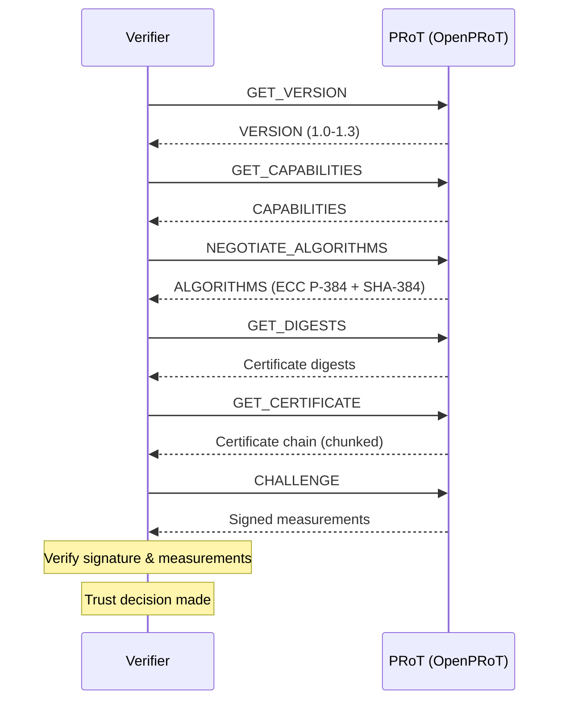

# SPDM — Security & Attestation

**Security Protocol and Data Model** (DMTF DSP0274)

SPDM establishes trust between platform components. It answers: *"Are you who you claim to be, and is your firmware intact?"*

## Key Capabilities

| Capability | Purpose | Status |
|-----------|---------|--------|
| **Authentication** | Verify device identity via certificate chains | Implemented |
| **Attestation** | Report firmware measurements (integrity proof) | Implemented |
| **Secure Sessions** | Encrypted communication channels | Not yet implemented |
| **CSR Generation** | Request new certificates | Not yet implemented |

## Implementation Status

The [`spdm-lib`](https://github.com/OpenPRoT/spdm-lib) is forked from [Caliptra MCU](https://github.com/chipsalliance/caliptra-mcu-sw) and actively developed on the `openprot` branch.

**Supported SPDM versions:** 1.0, 1.1, 1.2, 1.3

**Currently implemented: Responder only.** The responder handles the core authentication flow:

| Request | Response | Handler |
|---------|----------|---------|
| `GET_VERSION` | `VERSION` | Version negotiation |
| `GET_CAPABILITIES` | `CAPABILITIES` | Feature discovery |
| `NEGOTIATE_ALGORITHMS` | `ALGORITHMS` | Algorithm selection |
| `GET_DIGESTS` | `DIGESTS` | Certificate chain hashes |
| `GET_CERTIFICATE` | `CERTIFICATE` | Certificate chain retrieval (chunked) |
| `CHALLENGE` | `CHALLENGE_AUTH` | Signed measurement proof |
| `GET_MEASUREMENTS` | `MEASUREMENTS` | Firmware measurement blocks |
| `CHUNK_GET` | `CHUNK_RESPONSE` | Large response chunking |

**Not yet implemented:** Requester role, KEY_EXCHANGE, PSK_EXCHANGE, session-based messaging.

## Cryptographic Algorithms

While the protocol layer defines support for many algorithms (RSA, ECDSA P-256/P-384/P-521, EdDSA, SHA-2/3, etc.), the current implementation is **hardcoded to:**

- **Signing:** ECC P-384 (ECDSA)
- **Hashing:** SHA-384

Post-quantum algorithm support is noted as a future extension.

## Architecture

The library is `#![no_std]` (with `extern crate alloc` for `async_trait`). Key design:

- **Platform Abstraction Layer:** Four async traits integrators must implement:
  - `SpdmTransport` — send/receive over MCTP or other transport
  - `SpdmHash` — hash operations (init/update/finalize)
  - `SpdmRng` — random number generation
  - `SpdmEvidence` — PCR quote retrieval for measurements
- **Zero-copy codec:** `zerocopy` + `bitfield` crates for wire-format serialization
- **Transcript management:** VCA buffer (256 bytes) + streaming M1/L1 hash contexts for signing
- **Certificate store:** Up to 2 slots, async trait for chain reading, root hash, and signing
- **Measurements:** Freeform manifest type with DMTF measurement specification support

## Attestation Flow

---

[Prev: MCTP](mctp.md) | [Next: PLDM](pldm.md)
