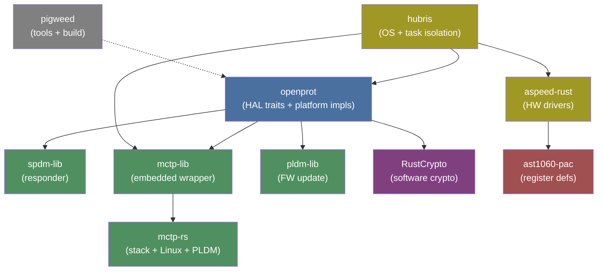

# Repository Map

| Repository | Description | License |
|-----------|-------------|---------|
| [`openprot`](https://github.com/OpenPRoT/openprot) | **Main repo** — 12-crate workspace: HAL traits, platform impls, services | Apache-2.0 |
| [`mctp-lib`](https://github.com/OpenPRoT/mctp-lib) | Thin MCTP wrapper around `mctp-estack` with Router + cookie-based API | Apache-2.0 |
| [`mctp-rs`](https://github.com/OpenPRoT/mctp-rs) | MCTP workspace by Code Construct: base types, Linux sockets, embedded stack, PLDM FW update, CLI tools | MIT/Apache-2.0 |
| [`spdm-lib`](https://github.com/OpenPRoT/spdm-lib) | SPDM responder (forked from Caliptra MCU), SPDM 1.0-1.3, ECC P-384 + SHA-384 | Apache-2.0 |
| [`pldm-lib`](https://github.com/OpenPRoT/pldm-lib) | PLDM Base + Firmware Update library (3-crate workspace) | Apache-2.0 |
| [`aspeed-rust`](https://github.com/OpenPRoT/aspeed-rust) | AST1060/AST1030 BSP: I2C, SPI, UART, GPIO, HACE crypto, SPI monitor drivers | Apache-2.0 |
| [`hubris`](https://github.com/OpenPRoT/hubris) | Fork of Oxide's Hubris — adds AST1060 support, MCTP/digest/ECDSA servers | MPL-2.0 (upstream) / Apache-2.0 (OpenPRoT additions) |
| [`pigweed`](https://github.com/OpenPRoT/pigweed) | Unmodified fork of Google's Pigweed — developer tooling (logging, RPC, build) | Apache-2.0 |
| [`.github`](https://github.com/OpenPRoT/.github) | CHIPS Alliance charter, TSC governance, security policy | Apache-2.0 |

## How Repositories Relate

## Key Crate Details

### `openprot` — Main Workspace (12 crates)

| Crate | Package Name | Purpose |
|-------|-------------|---------|
| `hal/blocking` | `openprot-hal-blocking` | Core HAL traits: digest, ECDSA, cipher, MAC, key vault, I2C, GPIO, system control |
| `hal/async` | `openprot-hal-async` | Re-exports `embedded-hal-async` 1.0 |
| `hal/nb` | `openprot-hal-nb` | Re-exports `embedded-hal-nb` 1.0 |
| `platform/impls/rustcrypto` | `platform-rustcrypto-impl` | Software crypto via RustCrypto (p256/p384, sha2/sha3, aes-gcm) |
| `platform/impls/hubris` | — | Hubris OS platform integration |
| `platform/impls/linux` | — | Linux platform integration |
| `platform/impls/tock` | — | Tock OS platform integration |
| `platform/impls/baremetal/mock` | `openprot-platform-mock` | Mock/stub for testing |
| `platform/traits/hubris` | — | `CryptoSession` RAII + Hubris IDL traits |
| `services/telemetry` | `openprot-services-telemetry` | Telemetry (stub) |
| `services/storage` | `openprot-services-storage` | Storage (stub) |
| `xtask` | — | Build automation |

### `hubris` — OpenPRoT App Images

| App Image | Tasks | Purpose |
|-----------|-------|---------|
| `ast1060-starter` | uart_driver, helloworld | Minimal hello-world |
| `ast1060-i2c-scaffold` | mock-i2c, i2c-client, uart | I2C development/testing |
| `ast1060-digest-test` | digest-server (RustCrypto), hmac-client | SHA/HMAC testing |
| `ast1060-ecdsa-test` | ecdsa-server, ecdsa-test, uart | ECDSA testing |
| `ast1060-mctp-echo` | mctp-server (serial), mctp-echo | MCTP echo test |

---

[Prev: PLDM](03-protocols/pldm.md) | [Next: Hardware Targets](05-hardware-targets.md)
