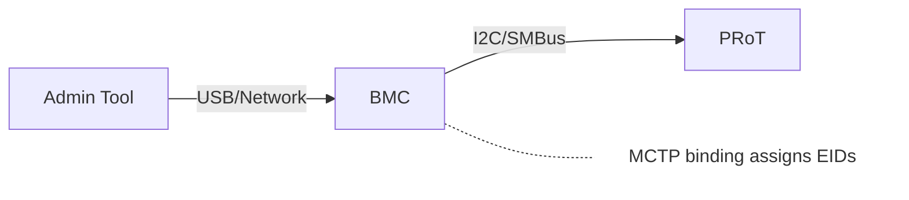
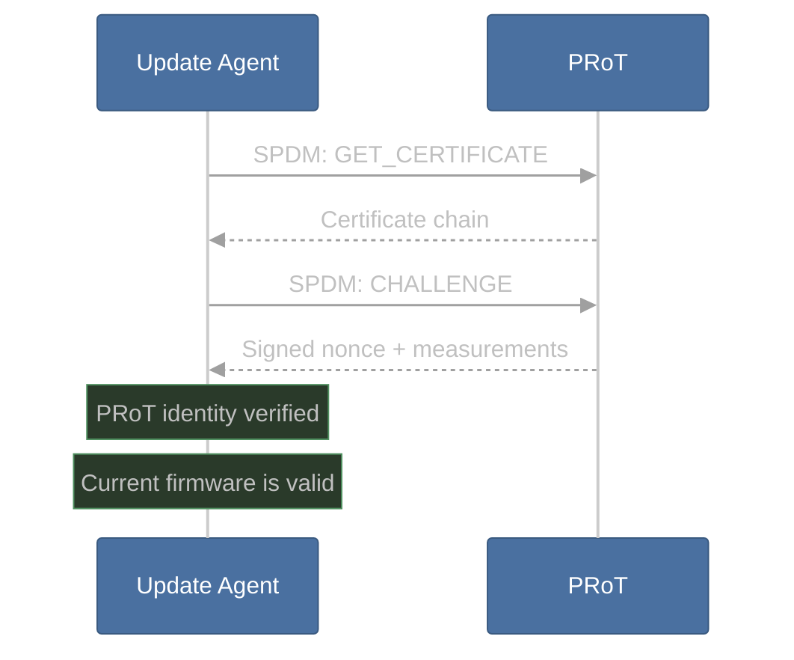
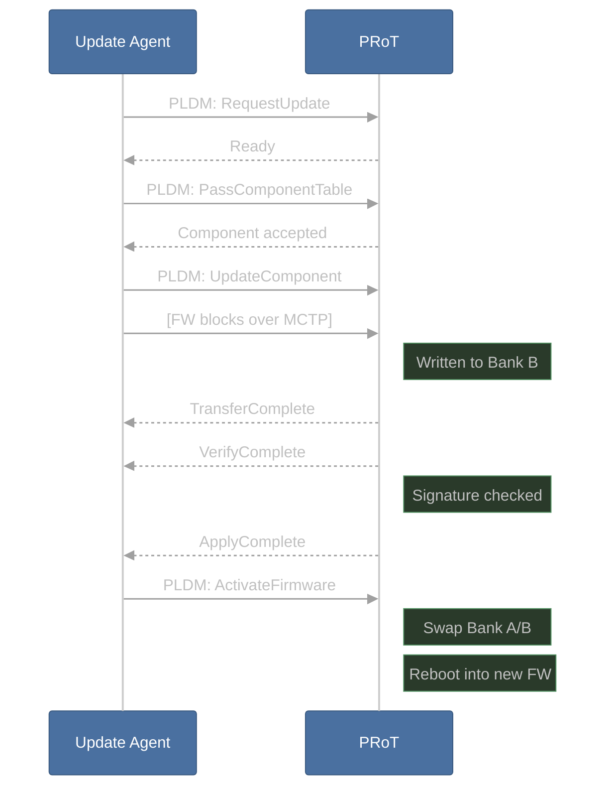
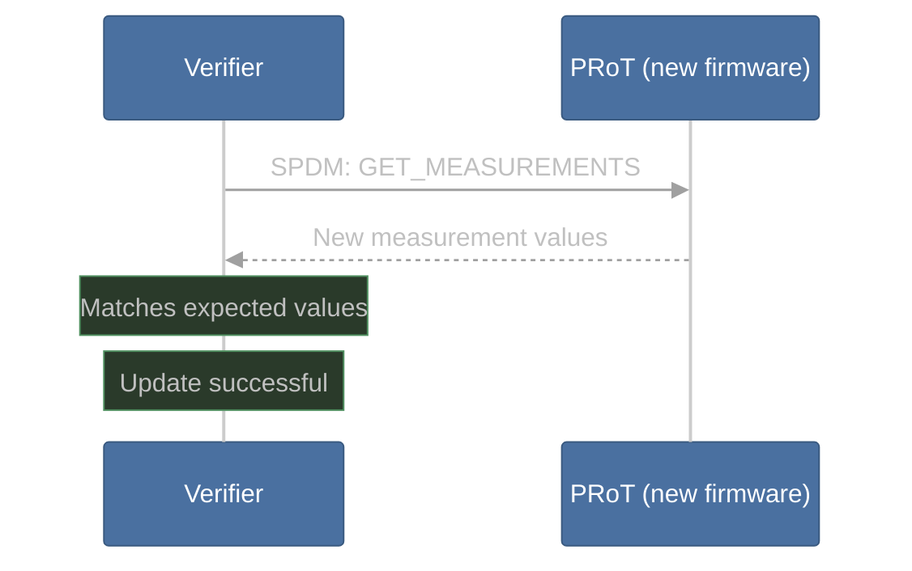

# Tutorial: Secure Firmware Update

This tutorial walks through how the three core protocols — MCTP, SPDM, and PLDM — work together in a real scenario. By following these steps, you'll understand the complete lifecycle of a secure firmware update on an OpenPRoT device.

## Learning Goals

By the end of this tutorial, you will understand:
- How MCTP establishes communication between components
- How SPDM authenticates devices before sensitive operations
- How PLDM transfers and activates firmware
- How post-update attestation confirms success

## Scenario

A server admin pushes a firmware update to a PRoT running OpenPRoT. Here's what happens at each layer of the protocol stack.

---

## Step 1: Transport Setup (MCTP)

The MCTP layer establishes communication. Each component gets an Endpoint ID (EID), and messages are routed over the physical transport (I2C, USB, etc.).

**What happens:**
1. The BMC's MCTP stack discovers the PRoT on the I2C bus
2. EIDs are assigned (e.g., BMC = EID 10, PRoT = EID 20)
3. A communication path is established for higher-layer protocols

---

## Step 2: Authentication (SPDM)

Before accepting any firmware, the PRoT and update agent authenticate each other:

**What happens:**
1. The update agent requests the PRoT's certificate chain
2. The agent sends a cryptographic challenge
3. The PRoT signs the challenge with its private key and includes firmware measurements
4. The agent verifies the signature and checks that the current firmware is known-good

---

## Step 3: Firmware Transfer (PLDM)

With trust established, the actual update proceeds:

**What happens:**
1. The update agent announces the update intent
2. The PRoT receives the component table describing what's being updated
3. Firmware blocks are transferred over MCTP and written to the inactive bank (Bank B)
4. The PRoT verifies the firmware signature
5. On activation, the banks swap and the device reboots into the new firmware

---

## Step 4: Post-Update Attestation (SPDM)

After reboot, the verifier confirms the new firmware:

**What happens:**
1. A verifier (which may be a different entity than the update agent) queries the PRoT
2. The PRoT reports its new firmware measurements
3. The verifier checks these match the expected values for the new firmware version
4. If they match, the update is confirmed successful

---

## Summary

The three protocols have distinct, complementary roles:

| Protocol | Role in this scenario |
|----------|----------------------|
| **MCTP** | Delivers all messages between BMC and PRoT over I2C |
| **SPDM** | Authenticates the PRoT before and after the update |
| **PLDM** | Manages the firmware transfer, verification, and activation |

Each protocol does one thing well, and together they provide a complete, secure firmware update lifecycle.

---

[Prev: Building & Running](07-building-and-running.md) | [Next: Services Deep Dive](09-services-deep-dive.md)
