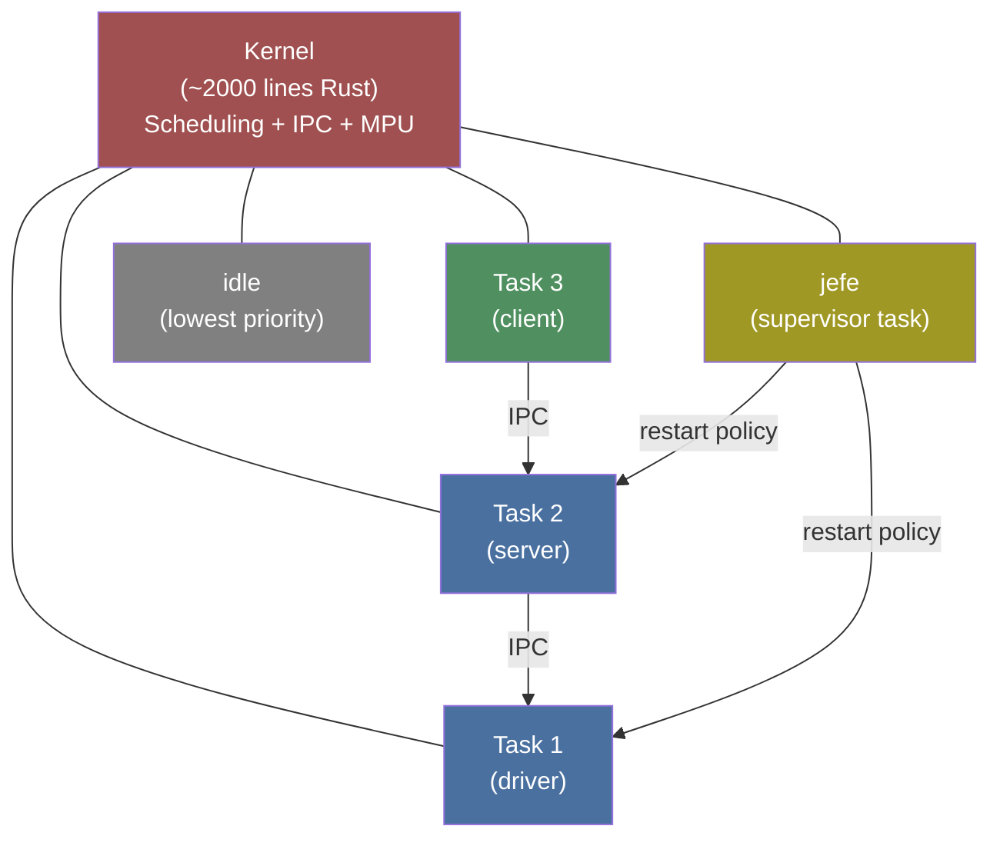
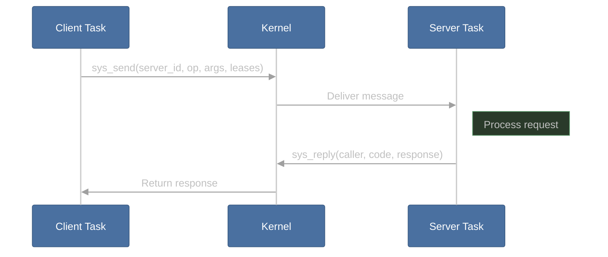
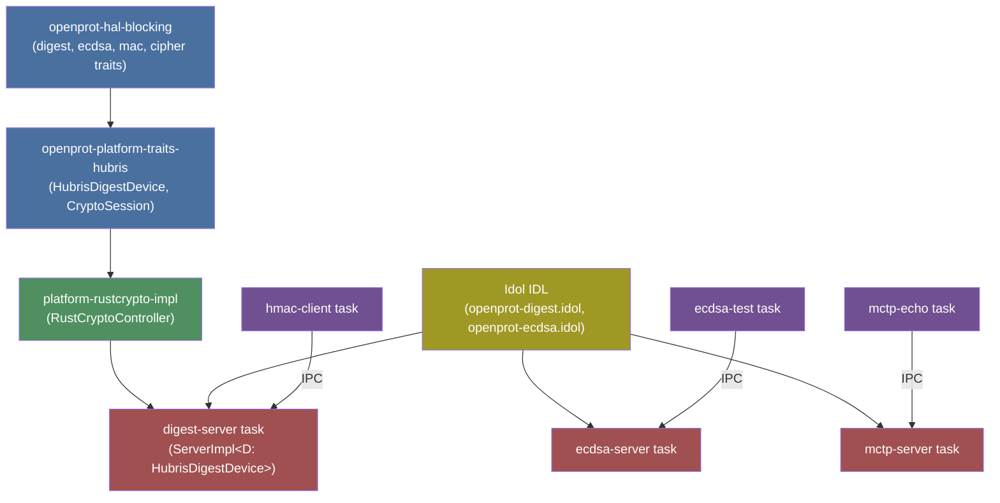

# Hubris OS Guide

Hubris is the primary OS target for OpenPRoT. This guide covers its architecture, how tasks work, and how to write OpenPRoT services on Hubris.

## Architecture Overview

Hubris is a lightweight, memory-protected, message-passing microkernel by [Oxide Computer Company](https://oxide.computer). It targets 32-bit ARM Cortex-M microcontrollers.



### Key Design Principles

| Principle | Description |
|-----------|-------------|
| **Minimal kernel** | ~2000 lines of Rust. Only scheduling, MPU management, and IPC. |
| **All tasks unprivileged** | Every task (including drivers) runs in unprivileged mode, isolated by the MPU. |
| **No dynamic allocation** | All memory is statically allocated at build time. No heap anywhere. |
| **No C code** | The entire system is Rust — kernel, drivers, and application tasks. |
| **Static task graph** | Tasks are defined at compile time. No runtime task creation or destruction. |
| **Component-level restart** | Individual tasks can crash and restart without affecting the system. |

### How It Differs from Traditional RTOS

| Aspect | Traditional RTOS (FreeRTOS, Zephyr) | Hubris |
|--------|-------------------------------------|--------|
| Driver isolation | Drivers share kernel address space | Drivers are isolated tasks with MPU protection |
| Memory model | Shared memory, optional MPU | Mandatory MPU isolation for every task |
| Task creation | Dynamic at runtime | Static, defined at compile time |
| Crash handling | Usually system-wide reset | Per-task restart managed by supervisor |
| IPC | Queues, semaphores, shared memory | Synchronous message passing with leases |
| Language | C/C++ | Pure Rust |

## Task System

### TaskId and Generations

Every task has a `TaskId` combining a **task index** (compile-time known) and a **generation number** (incremented on restart). This prevents stale IPC — if a task crashes and restarts, callers using the old generation get a `DEAD` error and can retry.

```rust
// From sys/abi/src/lib.rs
pub struct TaskId(pub u16);
// Lower 10 bits = task index, upper bits = generation
```

### task_slot! Macro

Tasks reference each other through **task slots**, bound at build time by the app TOML:

```rust
// In your task's main.rs
task_slot!(DIGEST, digest_server);  // Declares a slot named DIGEST

#[export_name = "main"]
fn main() -> ! {
    let digest = drv_digest_api::Digest::from(DIGEST.get_task_id());
    // Now you can call IPC methods on the digest server
}
```

The `task-slots` field in the app TOML wires the connection:
```toml
[tasks.hmac_client]
name = "task-hmac-client"
task-slots = ["digest_server"]  # Binds DIGEST slot to digest_server task
```

### Task Lifecycle

1. **Boot** — Kernel starts all tasks marked `start = true`
2. **Run** — Tasks execute in unprivileged mode, communicating via IPC
3. **Fault** — If a task panics or violates MPU rules, the kernel suspends it
4. **Restart** — The `jefe` supervisor decides restart policy, increments generation
5. **Recovery** — Callers detect the new generation and retry

## IPC Mechanism

Hubris IPC is **synchronous message passing**:



### Leases: Zero-Copy Memory Sharing

Instead of copying data between tasks, Hubris uses **leases** — the kernel temporarily maps a slice of the caller's memory into the server's address space:

```rust
// Client side — lending a buffer
let data = [0u8; 256];
sys_send(server_id, OP_HASH, &args, &mut [], &[Lease::from(&data)]);

// Server side — borrowing the lease
let caller = sys_recv_open(&mut msg_buf, notification_mask);
let mut buf = [0u8; 256];
let n = caller.borrow(0, &mut buf);  // Read from lease 0
```

### Notifications

Tasks can also send lightweight **notifications** (bitmask-based, non-blocking):

```rust
// Wait for a notification bit
sys_recv_notification(notifications::UART_IRQ_MASK);
```

Interrupts are delivered as notifications to the task that owns the interrupt.

## Idol IDL

**Idol** is Hubris's Interface Definition Language. It generates type-safe IPC client/server stubs from `.idol` files.

### Syntax Example

From `idl/openprot-digest.idol`:
```rust
Interface(
    name: "Digest",
    ops: {
        "init_sha256": (
            reply: Result(
                ok: "u32",  // session_id
                err: Complex("HubrisCryptoError"),
            ),
        ),
        "update": (
            args: { "session_id": "u32", "len": "u32" },
            leases: {
                "data": (type: "[u8]", read: true, max_len: Some(1024)),
            },
            reply: Result(ok: "()", err: Complex("HubrisCryptoError")),
        ),
        "finalize_sha256": (
            args: { "session_id": "u32" },
            leases: {
                "hash": (type: "[u8; 32]", write: true),
            },
            reply: Result(ok: "()", err: Complex("HubrisCryptoError")),
        ),
    }
)
```

### What Idol Generates

| Generated | Location | Purpose |
|-----------|----------|---------|
| `drv_digest_api::Digest` | Client stub | Type-safe IPC calls with automatic lease handling |
| `idl::InOrderDigestImpl` | Server trait | Trait the server implements for each operation |
| Error types | Shared | `HubrisCryptoError` with IPC error mapping |

## App TOML Configuration

Each firmware image is defined by an **app TOML** file that declares all tasks, their resources, and connections.

### Anatomy of an App TOML

```toml
# app/ast1060-digest-test/app.toml
name = "ast1060-digest-test"
target = "thumbv7em-none-eabihf"
board = "ast1060-rot"
chip = "../../chips/ast1060"
stacksize = 1024

[kernel]
name = "ast1060-digest-test"
requires = {flash = 40000, ram = 6144}

[tasks.jefe]                          # Supervisor — always present
name = "task-jefe"
priority = 0
max-sizes = {flash = 8192, ram = 4096}
start = true
stacksize = 1536
notifications = ["fault", "timer"]

[tasks.idle]                          # Idle task — always present
name = "task-idle"
priority = 5
max-sizes = {flash = 128, ram = 256}
stacksize = 256
start = true

[tasks.digest_server]                 # Crypto service task
name = "digest-server"
priority = 2
max-sizes = {flash = 32768, ram = 16384}
start = true
stacksize = 8192
features = ["rustcrypto"]             # Select crypto backend

[tasks.hmac_client]                   # Test client task
name = "task-hmac-client"
priority = 3
max-sizes = {flash = 32768, ram = 8192}
start = true
stacksize = 4096
task-slots = ["digest_server"]        # IPC binding
```

### Key Fields

| Field | Purpose |
|-------|---------|
| `name` | Crate name to compile |
| `priority` | 0 = highest (jefe), higher numbers = lower priority |
| `max-sizes` | Flash and RAM budget for MPU regions |
| `stacksize` | Task stack size in bytes |
| `task-slots` | IPC connections to other tasks |
| `features` | Cargo features to enable |
| `uses` | Hardware peripherals this task owns |
| `notifications` | Named notification bits |
| `interrupts` | Hardware interrupt → notification mapping |

## OpenPRoT on Hubris

### Available App Images

| Image | Tasks | Purpose |
|-------|-------|---------|
| `ast1060-starter` | jefe, idle, uart_driver, helloworld | Minimal hello world |
| `ast1060-digest-test` | jefe, idle, digest_server, hmac_client | SHA/HMAC testing |
| `ast1060-ecdsa-test` | jefe, idle, uart_driver, ecdsa_server, ecdsa_test | ECDSA P-384 testing |
| `ast1060-i2c-scaffold` | jefe, idle, mock_i2c, i2c_client, uart_driver | I2C development |
| `ast1060-mctp-echo` | jefe, idle, mctp_server, mctp_echo | MCTP echo test |

### Platform Integration Architecture



### Connection Chain

1. **`openprot-hal-blocking`** defines abstract traits (DigestInit, DigestOp, MacInit, etc.)
2. **`openprot-platform-traits-hubris`** bridges them to Hubris with `CryptoSession<Context, Device>` RAII and `HubrisDigestDevice` trait
3. **`platform-rustcrypto-impl`** provides `RustCryptoController` implementing these traits via the RustCrypto ecosystem
4. **Idol IDL** generates IPC stubs (client + server)
5. **Server tasks** (e.g., `digest-server`) wrap a `HubrisDigestDevice` impl and handle IPC
6. **Client tasks** use generated API crates (e.g., `drv_digest_api::Digest`)

## Tutorial: Building Your First Hubris Task

### Step 1: Create the Task Crate

```bash
mkdir -p task/my-task/src
```

`task/my-task/Cargo.toml`:
```toml
[package]
name = "task-my-task"
version = "0.1.0"
edition = "2021"

[dependencies]
userlib = { path = "../../sys/userlib", features = ["panic-messages"] }
drv-digest-api = { path = "../../drv/digest-api" }
```

`task/my-task/src/main.rs`:
```rust
#![no_std]
#![no_main]

use userlib::*;

task_slot!(DIGEST, digest_server);

#[export_name = "main"]
fn main() -> ! {
    let digest = drv_digest_api::Digest::from(DIGEST.get_task_id());

    // Hash some data using SHA-256
    let session = digest.init_sha256().unwrap();
    digest.update(session, b"Hello OpenPRoT!").unwrap();
    let mut hash = [0u8; 32];
    digest.finalize_sha256(session, &mut hash).unwrap();

    loop {
        hl::sleep_for(1000);
    }
}
```

### Step 2: Define the App Image

`app/my-app/app.toml`:
```toml
name = "my-app"
target = "thumbv7em-none-eabihf"
board = "ast1060-rot"
chip = "../../chips/ast1060"
stacksize = 1024

[kernel]
name = "my-app"
requires = {flash = 40000, ram = 6144}

[tasks.jefe]
name = "task-jefe"
priority = 0
max-sizes = {flash = 8192, ram = 4096}
start = true
stacksize = 1536
notifications = ["fault", "timer"]

[tasks.idle]
name = "task-idle"
priority = 5
max-sizes = {flash = 128, ram = 256}
stacksize = 256
start = true

[tasks.digest_server]
name = "digest-server"
priority = 2
max-sizes = {flash = 32768, ram = 16384}
start = true
stacksize = 8192
features = ["rustcrypto"]

[tasks.my_task]
name = "task-my-task"
priority = 3
max-sizes = {flash = 16384, ram = 4096}
start = true
stacksize = 2048
task-slots = ["digest_server"]
```

### Step 3: Build and Run

```bash
# Build the firmware image
cargo xtask dist app/my-app/app.toml

# Run in QEMU
qemu-system-arm \
  -M ast1030-evb \
  -nographic \
  -kernel target/my-app/dist/default/final.bin

# Or flash to real hardware
cargo xtask flash app/my-app/app.toml
```

### Step 4: Debug with Humility

[Humility](https://github.com/oxidecomputer/humility) is the companion debugger for Hubris:

```bash
# List all tasks and their status
humility tasks

# Read a task's ring buffer (debug trace)
humility ringbuf my_task

# Inspect task memory
humility readmem my_task 0x20000000 256
```

---

[Prev: Code Examples](13-code-examples.md) | [Next: Tock OS Guide](15-tock-guide.md)
