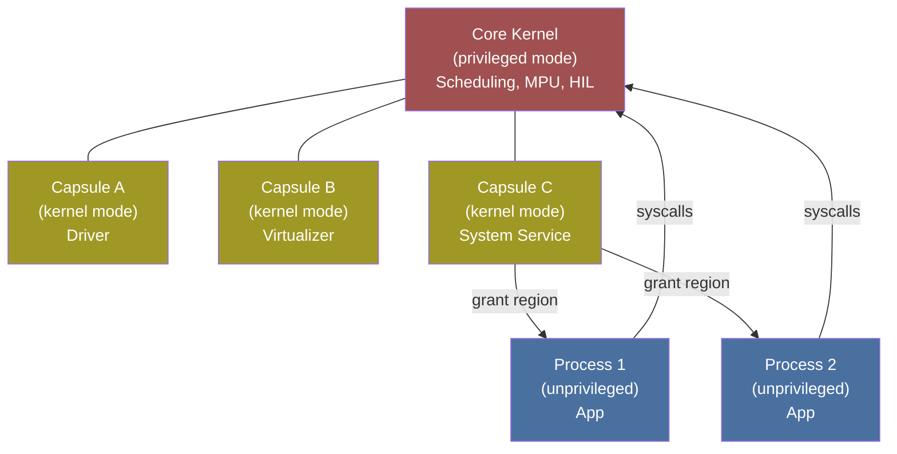
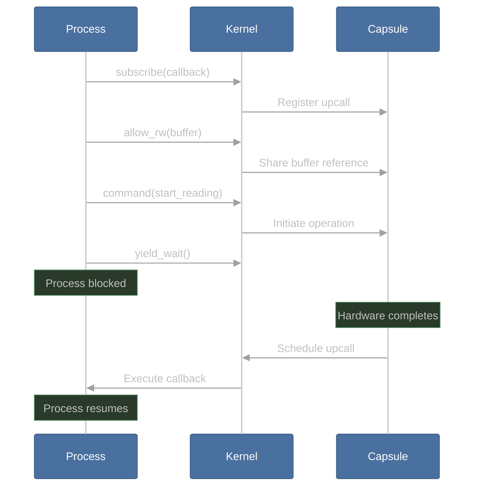

# Tock OS Guide

Tock is a secure embedded operating system designed for running multiple untrusted applications on low-power microcontrollers. OpenPRoT includes a Tock platform implementation crate (currently a placeholder).

## Architecture Overview

Tock uses three trust domains with different isolation mechanisms:



| Domain | Isolation | Code Location |
|--------|-----------|---------------|
| **Core Kernel** | Hardware privilege level | `kernel/` crate |
| **Capsules** | Rust type system (compile-time) | `capsules/` crates, share kernel address space |
| **Processes** | Hardware MPU (runtime) | Separately compiled, any language |

## Capsules

Capsules are kernel-mode components (drivers, virtualizers, protocol stacks) isolated by Rust's ownership system rather than hardware:

```rust
pub struct TemperatureDriver<'a, T: hil::sensors::TemperatureDriver<'a>> {
    sensor: &'a T,
    apps: Grant<AppData, UpcallCount<1>, AllowRoCount<0>, AllowRwCount<0>>,
    busy: Cell<bool>,
}
```

A capsule can only access resources explicitly passed to it during board initialization. It cannot touch other capsules' memory or arbitrary hardware — Rust's type system enforces this at compile time with zero runtime overhead.

### Capsules vs. Hubris Tasks

| Property | Tock Capsule | Hubris Task |
|----------|-------------|-------------|
| Isolation | Rust type system (compile-time) | Hardware MPU (runtime) |
| Crash impact | Could affect kernel (shares address space) | Contained — only that task restarts |
| Overhead | Zero (same address space) | MPU context switch per IPC |
| Trust model | Trusted code, verified at compile time | Untrusted — any task can crash safely |

## Processes

Processes are userland applications isolated by the MPU. They can be written in C (`libtock-c`) or Rust (`libtock-rs`) and loaded at runtime from flash.

### Memory Layout

```
┌─────────────────────┐ High address
│    Grant Region     │ ← Capsules allocate typed state here
│   (app cannot       │   (inaccessible to the process)
│    read/write)      │
├─────────────────────┤
│       Stack ↓       │
├─────────────────────┤
│       Heap ↑        │
├─────────────────────┤
│    .data / .bss     │
└─────────────────────┘ Low address
```

**Grant regions** are the key Tock innovation: capsules dynamically allocate per-process state from the top of each process's RAM. This eliminates the need for a kernel heap — capsules borrow memory from the processes they serve.

### Tock Binary Format (TBF)

Applications are packaged as TBF objects in flash:

1. **Header** — entry point, memory requirements, size
2. **Protected region** — kernel-managed persistent data
3. **Binary** — the actual code
4. **Padding** (optional)

```bash
# Convert ELF to TBF
elf2tab -o app.tab --stack 2048 --app-heap 1024 target/app.elf

# Install to board
tockloader install app.tab
```

## Syscall Interface

Processes interact with the kernel through six syscall classes:

| Syscall | Class | Purpose |
|---------|-------|---------|
| **Yield** | 0 | Block until an upcall is pending |
| **Subscribe** | 1 | Register a callback function with a driver |
| **Allow ReadWrite** | 2 | Share a read/write buffer with a capsule |
| **Allow ReadOnly** | 3 | Share a read-only buffer with a capsule |
| **Command** | 4 | Direct a driver to take an action |
| **Memop** | 5 | Memory management (adjust heap, query layout) |

### Typical Syscall Flow



## Hardware Interface Layer (HIL)

The HIL provides trait-based hardware abstraction. All operations that take more than a few cycles use a **split-phase** (async) pattern:

```rust
// Initiation trait
pub trait TemperatureDriver<'a> {
    fn set_client(&self, client: &'a dyn TemperatureClient);
    fn read_temperature(&self) -> Result<(), ErrorCode>;
}

// Completion callback trait
pub trait TemperatureClient {
    fn callback(&self, value: Result<i32, ErrorCode>);
}
```

### Driver Stack

```
Process (userland)
    ↕ syscalls
Capsule Driver (implements SyscallDriver)
    ↕ HIL traits
Virtualizer Capsule (optional, multiplexes access)
    ↕ HIL traits
Hardware Platform Layer (HPL, chip-specific)
    ↕ register access
Hardware
```

## Board Configuration

Each board is a Rust crate under `boards/`. The `main.rs` wires capsules to chip peripherals using the **Component pattern**:

```rust
// boards/nordic/nrf52840dk/src/main.rs (simplified)
let console = ConsoleComponent::new(board_kernel, uart_mux)
    .finalize(components::console_component_static!());

let temperature = TemperatureComponent::new(board_kernel, nrf52840::temperature::TEMP)
    .finalize(components::temperature_component_static!());

let scheduler = RoundRobinSched::new();
board_kernel.kernel_loop(
    &platform,
    chip,
    Some(&platform.ipc),
    &scheduler,
    &main_loop_capability,
);
```

## Hubris vs. Tock: Detailed Comparison

| Aspect | Hubris | Tock |
|--------|--------|------|
| **Primary goal** | Fixed tasks on infrastructure MCUs | Multiple untrusted apps on IoT devices |
| **Kernel size** | ~2000 lines | Larger (scheduler + HIL + capsule framework) |
| **Driver isolation** | MPU-isolated tasks (hardware) | Type-system isolated capsules (compile-time) |
| **Dynamic loading** | No — all tasks compiled together | Yes — processes loaded at runtime |
| **IPC** | Synchronous message passing + leases | Shared-buffer + notify between processes |
| **Scheduling** | Preemptive priority for all tasks | Cooperative (kernel) + preemptive (processes) |
| **Crash recovery** | Per-task restart (supervisor) | Per-process restart (kernel decides) |
| **Dynamic allocation** | None — fully static | Grant regions (from process memory) |
| **C code** | Zero | Processes can be C/C++ |
| **Target platforms** | ARM Cortex-M only | Cortex-M, RISC-V, x86 |
| **Build model** | `xtask` builds entire image | Kernel + apps built separately |
| **App installation** | Re-flash entire image | `tockloader install` at runtime |

### When to Use Which

| Scenario | Better Choice |
|----------|--------------|
| Fixed-function PRoT firmware | **Hubris** — static task graph, maximum isolation |
| Multi-tenant IoT device | **Tock** — dynamic app loading, untrusted code support |
| Need to update apps without reflashing kernel | **Tock** — separate kernel and app images |
| Maximum reliability for infrastructure | **Hubris** — per-task restart, no shared address space |
| Third-party app ecosystem | **Tock** — designed for untrusted code |
| Zero C code requirement | **Hubris** — pure Rust system |

## OpenPRoT on Tock

### Current Status

The `platform/impls/tock/` crate in the openprot repo is a **placeholder** — it has the crate structure but no trait implementations yet.

### How Integration Would Work

OpenPRoT could integrate with Tock in two ways:

**Option A: As a Tock Process** (using `libtock-rs`)
```rust
// Hypothetical OpenPRoT Tock process
use libtock::syscalls;

const CRYPTO_DRIVER: u32 = 0x40003;

fn sha256_hash(data: &[u8], out: &mut [u8; 32]) -> Result<(), Error> {
    syscalls::allow_ro(CRYPTO_DRIVER, 0, data)?;
    syscalls::allow_rw(CRYPTO_DRIVER, 0, out)?;
    syscalls::subscribe(CRYPTO_DRIVER, 0, callback)?;
    syscalls::command(CRYPTO_DRIVER, 1, 0, 0)?;  // CMD_SHA256
    syscalls::yield_wait();
    Ok(())
}
```

**Option B: As a Tock Capsule** (kernel-mode, direct HIL access)
```rust
// Hypothetical OpenPRoT crypto capsule
use kernel::hil::symmetric_encryption::{AES128, AES128Ctr};

pub struct OpenProtCrypto<'a, A: AES128<'a> + AES128Ctr> {
    aes: &'a A,
    apps: Grant<AppData, UpcallCount<1>, AllowRoCount<1>, AllowRwCount<1>>,
}
```

### Key Differences from Hubris Integration

| Aspect | Hubris Approach | Tock Approach |
|--------|----------------|---------------|
| Crypto service | Isolated task with Idol IPC | Capsule (kernel mode) or process (syscalls) |
| Session management | `CryptoSession` RAII | Grant region per-process state |
| API style | Synchronous IPC | Split-phase (subscribe + command + yield) |
| Memory sharing | Leases (kernel-mediated) | Allow buffers (syscall-mediated) |

---

[Prev: Hubris Guide](14-hubris-guide.md) | [Back to Guide Home](README.md)
